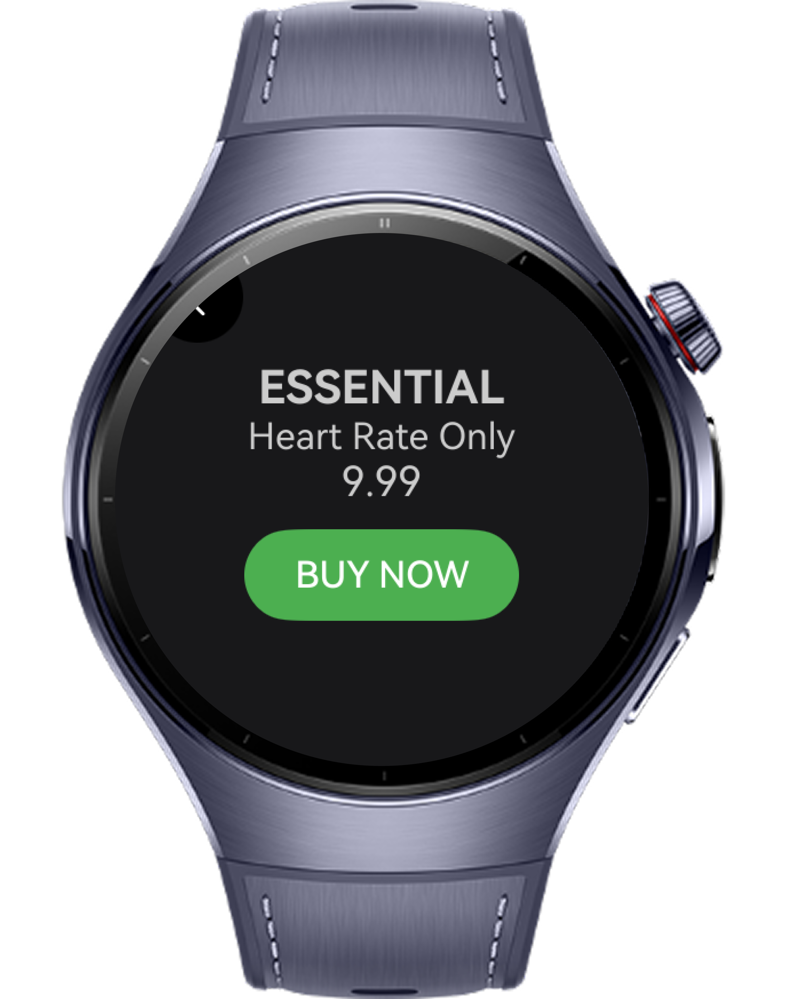
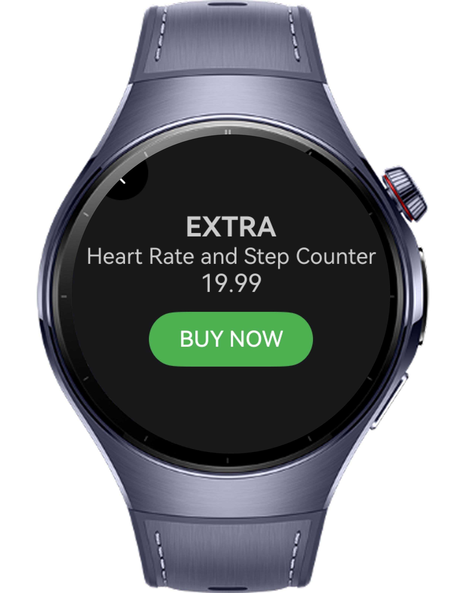
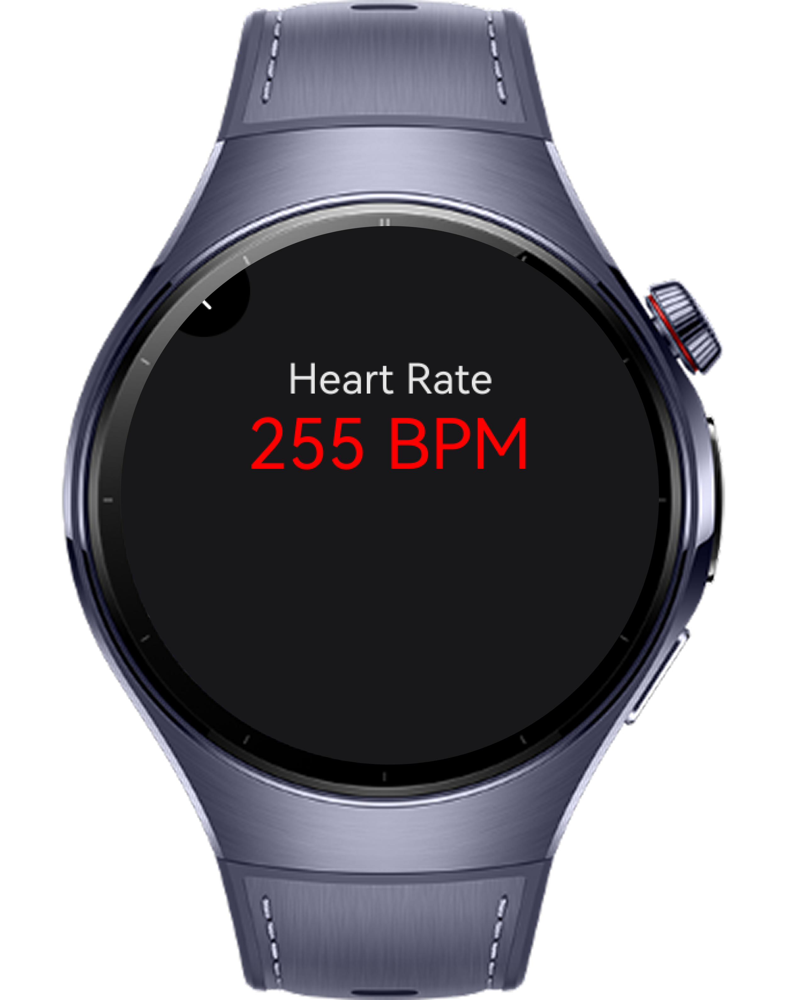
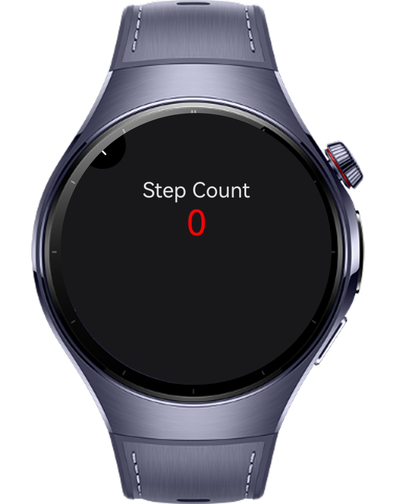

> **Note:** To access all shared projects, get information about environment setup, and view other guides, please visit [Explore-In-HMOS-Wearable Index](https://github.com/Explore-In-HMOS-Wearable/hmos-index).

# HealthStorage App
HealthStorage is a smart and secure health-tracking application designed to help users monitor essential daily metrics with ease. By subscribing to either the Essential or Extra package, users gain access to real-time heart rate and step count tracking. All collected data is stored locally on the device, ensuring full privacy and complete user control.

HealthStorage offers a clean, intuitive interface and provides meaningful insights to help users stay aware of their physical activity and overall well-being.

# Preview

<div>
  
  
  
  
</div>


# Use Cases

1. Through the Essential or Extra packages, users can unlock premium features such as enhanced tracking, analytics, or expanded historical data.
2. Users can instantly view their current heart rate and daily step count, helping them stay informed about their physical activity levels throughout the day.
3. All health data is securely saved in a local database on the user’s device—no cloud upload, no external servers. Ideal for users who prioritize data privacy.

# Technology

## Stack

- **Languages**: ArkTS, ArkUI
- **Frameworks**: HarmonyOS 5.1.0(18)
- **Tools**: DevEco Studio Vers 5.1.0.828SP1,
- **Libraries**: @kit.ArkUI, @kit.IAPKit, @ohos.data.relationalStore, @ohos.data.preferences

## Required Permissions

- `ohos.permission.READ_HEALTH_DATA`
  > Required to get heart rate data
- `ohos.permission.ACTIVITY_MOTION`
  > Required to get step counts.
- `ohos.permission.INTERNET`
  > Required to use and connect to internet


# Directory Structure

```
├───components
│       CommonConstants.ets
│       
├───data
│       ProductTypes.ets
│
├───entryability
│       EntryAbility.ets
│
├───pages
│       HealthData.ets
│       PurchaseProduct.ets
│       SplashScreen.ets
│
├───types
│       HealthRecords.ets
│       ProductType.ets
│
├───utils
│       HealthDataManager.ets
│       PreferencesManager.ets
│
├───view
└───viewModel

```

# Constraints and Restrictions

## Suported Devices

- Huawei Watch 5

## Limitations

- HealthStorage is not working on previewer or simulators
- Users need to apply health permissions and enable health activities in smart watch

# License

**HealthStorageApp** is distributed under the terms of the MIT License
See the [LICENSE](LICENSE) for more information.


